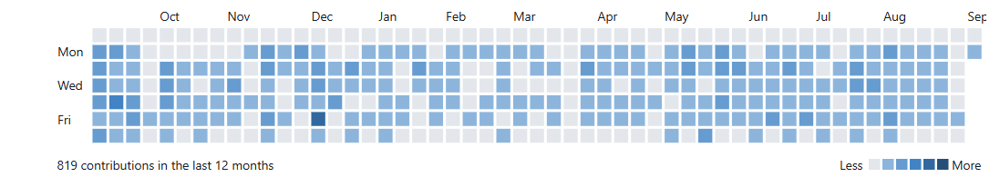

<h1 align="center">Hi, I'm Priyesh Ghosh 👋</h1>
<h3 align="center">Software Engineer | Full-Stack & Frontend Developer | AI Prompt Engineer</h3>

  Building scalable web products, real-time communication platforms, and AI-driven solutions.

  
  

---

### 🚀 About Me

- 🔭 Currently building scalable web products & real-time communication platforms
- 💡 4 years of experience across streaming platforms, WebRTC-based video/chat apps, and AI-driven tools
- 🤖 Working with **OpenAI**, **Claude**, and **Gemini** APIs — focused on prompt engineering and AI integration
- 🌱 Sharpening skills in system design, cloud deployment, and testing
- 📫 Reach me at **priyeshghosh1997@gmail.com**

---

### 🛠️ Tech Stack

**Frontend**

  
  
  
  
  
  
  
  

**Backend**

  
  
  

**Real-Time & Media**

  
  

**Auth & Identity**

  

**AI & Prompt Engineering**

  
  
  

**Tools & Platforms**

  
  
  

---

### 📌 Featured Projects

>

- **[Streamly]** — Netflix-style video streaming platform with integrated OTP login, Admin panel,Mech , Events , Channel management, and support for movie, video, and audio uploads and playback with NextJs. Keycloak · OIDC · Reduxs. `Next.js` `Socket.IO` `Redis`
- **[ChatWeb]** — Real-time communication and messaging platform using Socket.IO Node.js . `Nextjs` `TypeScript` ,`Socket.IO` `Redis` `WebRTC`
- **[MeetWeb]** — Video meeting and online collaboration platform using WebRTC , Keycloak with Recurrring Schedule Events . ` WebRTC` , `Keycloak` , `OpenAI API` `WebRTC`.

---

### 📊 GitHub Stats

  
  

  

---

<i>Thanks for stopping by — let's connect!</i>

